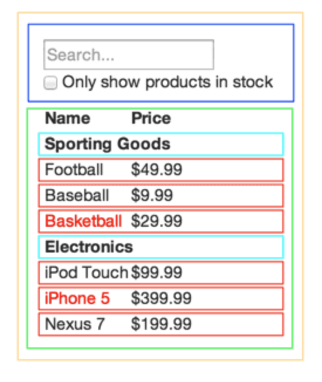

# **Thinking in React**

**Step 1: Break the UI Into A Component History**

- Draw boxes around every component in the mock and give them names

Single responsibility principle:
    - A component should only do one thing
    - If it does more, break it out into different components.


(source: https://reactjs.org/docs/thinking-in-react.html)

The components here are:

1. FilterableProductTable (orange): contains the entirety of the example
2. SearchBar (blue): receives all user input
3. ProductTable (green): displays and filters the data collection based on user input
4. ProductCategoryRow (turquoise): displays a heading for each category
5. ProductRow (red): displays a row for each product

(source: https://reactjs.org/docs/thinking-in-react.html)

Then, write the components as a hierarchy:

- FilterableProductTable
    - SearchBar
    - ProductTable
        - ProductCategoryRow
        - Product Row

(source: https://reactjs.org/docs/thinking-in-react.html)

**Step 2: Build a Static Version in React**

- Takes your data model and renders the UI but has no interactivity
    - Building a static version requires a lot of typing and no thinking
    - adding interactivity requires a lot of thinking and not a lot of typing

- Build top down or bottum up

Code example for the hierchy above:
```
class ProductCategoryRow extends React.Component {
  render() {
    const category = this.props.category;
    return (
      <tr>
        <th colSpan="2">
          {category}
        </th>
      </tr>
    );
  }
}

class ProductRow extends React.Component {
  render() {
    const product = this.props.product;
    const name = product.stocked ?
      product.name :
      <span style={{color: 'red'}}>
        {product.name}
      </span>;

    return (
      <tr>
        <td>{name}</td>
        <td>{product.price}</td>
      </tr>
    );
  }
}

class ProductTable extends React.Component {
  render() {
    const rows = [];
    let lastCategory = null;
    
    this.props.products.forEach((product) => {
      if (product.category !== lastCategory) {
        rows.push(
          <ProductCategoryRow
            category={product.category}
            key={product.category} />
        );
      }
      rows.push(
        <ProductRow
          product={product}
          key={product.name} />
      );
      lastCategory = product.category;
    });

    return (
      <table>
        <thead>
          <tr>
            <th>Name</th>
            <th>Price</th>
          </tr>
        </thead>
        <tbody>{rows}</tbody>
      </table>
    );
  }
}

class SearchBar extends React.Component {
  render() {
    return (
      <form>
        <input type="text" placeholder="Search..." />
        <p>
          <input type="checkbox" />
          {' '}
          Only show products in stock
        </p>
      </form>
    );
  }
}

class FilterableProductTable extends React.Component {
  render() {
    return (
      <div>
        <SearchBar />
        <ProductTable products={this.props.products} />
      </div>
    );
  }
}


const PRODUCTS = [
  {category: 'Sporting Goods', price: '$49.99', stocked: true, name: 'Football'},
  {category: 'Sporting Goods', price: '$9.99', stocked: true, name: 'Baseball'},
  {category: 'Sporting Goods', price: '$29.99', stocked: false, name: 'Basketball'},
  {category: 'Electronics', price: '$99.99', stocked: true, name: 'iPod Touch'},
  {category: 'Electronics', price: '$399.99', stocked: false, name: 'iPhone 5'},
  {category: 'Electronics', price: '$199.99', stocked: true, name: 'Nexus 7'}
];
 
ReactDOM.render(
  <FilterableProductTable products={PRODUCTS} />,
  document.getElementById('container')
);
```
(source: https://reactjs.org/docs/thinking-in-react.html)

**Step 3: Identify The Minimal (but complete) Representation Of UI State**

- Figure out the absolute minimum representation of the state your app needs

- *DRY: Don't Repeat Yourself*

Figure out what is state:
1. Is it passed in from a parent via props? If so, it probably isn’t state.
2. Does it remain unchanged over time? If so, it probably isn’t state.
3. Can you compute it based on any other state or props in your component? If so, it isn’t state.

(source: https://reactjs.org/docs/thinking-in-react.html)

**Step 4: Identify Where Your State Should Live**

Which components should own what state?
1. Identify every component that renders something based on that state.
2. Find a common owner component (a single component above all the components that need the state in the hierarchy).
3. Either the common owner or another component higher up in the hierarchy should own the state.
4. If you can’t find a component where it makes sense to own the state, create a new component solely for holding the state and add it somewhere in the hierarchy above the common owner component.

(source: https://reactjs.org/docs/thinking-in-react.html)

**Step 5: Add Inverse Data Flow**

Add callback functions and pass them as needed so that child components can update state on parent components.
